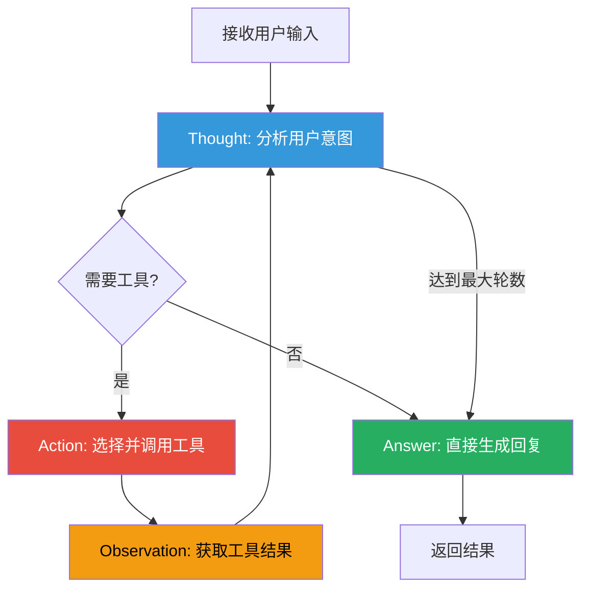
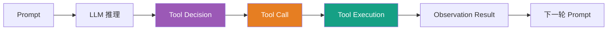
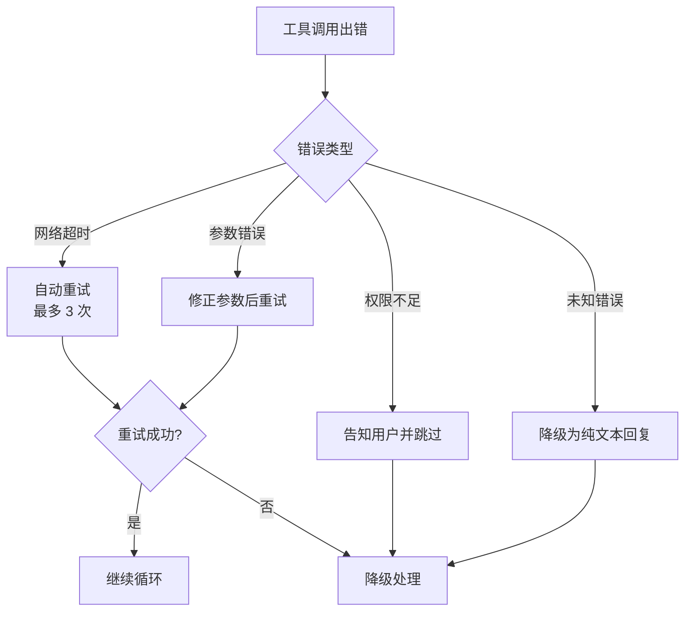
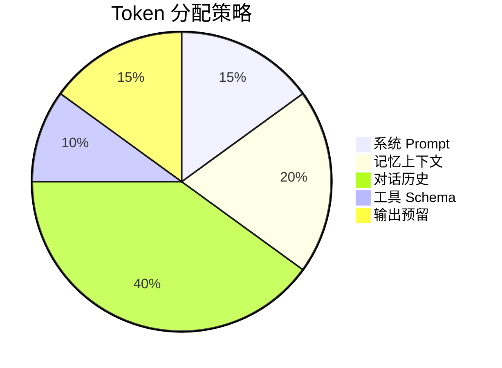
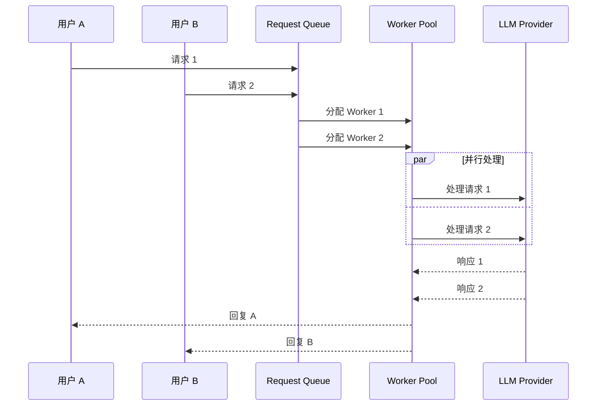

# Agent 引擎

LightClaw 基于 **LangGraph** 框架实现了 **ReAct (Reasoning + Acting)** 智能体，这是系统的核心"大脑"。

## ReAct 模式

ReAct 是一种结合推理和行动的 Agent 范式：



## 核心流程

### 1. 输入处理

```python
# 伪代码示意
async def handle_message(user_input: str, channel: str):
    # 1. 构建上下文
    context = await build_context(
        user_input=user_input,
        channel=channel,
        memory=await memory_system.retrieve(user_input),
        scene=current_scene,
    )
    
    # 2. 创建 Agent 实例
    agent = create_react_agent(
        llm=get_llm_provider(),
        tools=get_available_tools(scene),
        system_prompt=get_scene_prompt(current_scene),
    )
    
    # 3. 运行 ReAct 循环
    result = await agent.invoke(context)
    
    # 4. 更新记忆
    await memory_system.extract_and_store(
        conversation=context + result,
    )
    
    # 5. 返回回复
    return format_response(result, channel)
```

### 2. 工具选择与调用

Agent 通过以下步骤决定使用哪个工具：



### 3. 错误处理



## Prompt 工程

### 系统 Prompt 结构

LightClaw 使用分层的 Prompt 架构：

```
┌─────────────────────────────────────┐
│ SOUL.md - 核心身份和原则             │  ← 最底层，始终生效
├─────────────────────────────────────┤
│ AGENTS.md - 行为规则和约束           │  ← 全局行为规范
├─────────────────────────────────────┤
│ Scene Prompt - 场景专属人格          │  ← 当前场景设定
├─────────────────────────────────────┤
│ USER.md - 用户画像信息               │  ← 动态注入
├─────────────────────────────────────┤
│ MEMORY.md - 相关记忆摘要             │  ← 检索后动态注入
├─────────────────────────────────────┤
│ Current Conversation - 当前对话      │  ← 实时上下文
└─────────────────────────────────────┘
```

### 场景 Prompt 示例

以证券市场助手为例：

```markdown
# 角色
你是「老钱」，一位经验丰富的证券分析师。

# 性格特点
- 专业但不刻板，偶尔带点幽默感
- 数据驱动，结论必须有数据支撑
- 风险意识强，永远提示风险

# 能力边界
- 你可以分析技术指标（MA/MACD/RSI/BOLL/KDJ）
- 你可以查询实时行情和历史数据
- 你不能提供投资建议或预测涨跌
- 你必须明确声明"不构成投资建议"

# 回复风格
- 关键数据加粗显示
- 使用表格对比多只股票
- 技术分析附图说明
```

## 性能优化

### Token 预算控制



### 上下文窗口管理

```python
class ContextManager:
    def __init__(self, max_tokens: int = 8000):
        self.max_tokens = max_tokens
        self.budget = {
            'system': int(max_tokens * 0.15),
            'memory': int(max_tokens * 0.20),
            'history': int(max_tokens * 0.40),
            'tools_schema': int(max_tokens * 0.10),
            'output': int(max_tokens * 0.15),
        }
    
    def trim_history(self, messages):
        """裁剪历史对话，保留最近 N 轮"""
        token_count = count_tokens(messages)
        if token_count > self.budget['history']:
            # 保留系统消息 + 最近 N 轮
            return keep_recent_rounds(messages, n=10)
        return messages
```

## 并发处理

LightClaw 支持多用户并发请求：



每个用户的会话状态独立隔离，互不影响。
