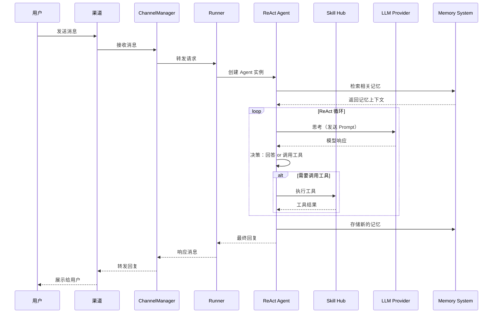
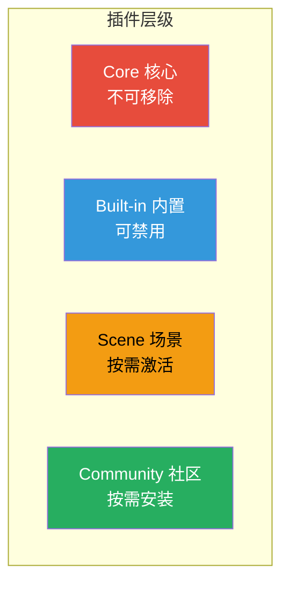

# 系统架构概览

## 整体架构

```
┌──────────────────────────────────────────────────────────┐
│                    LightClaw 应用                         │
│                                                          │
│  ┌──────────────┐   REST / WebSocket   ┌─────────────┐  │
│  │ Web Dashboard │◄────────────────────►│   FastAPI    │  │
│  │  (端口 80)    │                       │  API Server  │  │
│  └──────────────┘                       └─────────────┘  │
│         ▲                                      │          │
│         │                                      │          │
│  ┌──────┴──────┐                      ┌────────┴──────┐   │
│  │   React +   │                      │ Channel       │   │
│  │ TypeScript  │                      │ Manager       │   │
│  │ Ant Design  │                      │              │   │
│  └─────────────┘                      ├──────────────┤   │
│                                       │ Feishu QQ    │   │
│                                       │ DingTalk Disc│   │
│                                       └──────────────┘   │
│                                                 │          │
│                                       ┌────────▼──────┐   │
│                                       │   Runner      │   │
│                                       └───────┬──────┘   │
│                                               │           │
│                                       ┌───────▼──────┐   │
│                                       │ ReAct Agent   │   │
│                                       │ (LangGraph)   │   │
│                                       └───┬──────┬───┘   │
│                   ┌───────────────────────┤      │        │
│                   ▼                       ▼      ▼        │
│            ┌─────────────┐      ┌────────────┐ ┌──────┐  │
│            │ Skill Hub   │      │ LLM Provider│ │Memory│  │
│            │ 技能执行器   │      │ 多模型路由   │ │ 系统  │  │
│            └─────────────┘      └────────────┘ └──────┘  │
│                                                          │
│  数据目录: ~/.lightclaw/                                  │
└──────────────────────────────────────────────────────────┘
```

## 核心组件

| 组件 | 技术 | 职责 |
|------|------|------|
| **API Server** | FastAPI + Uvicorn | 提供 REST API 和 WebSocket 服务 |
| **Web Dashboard** | React + TS + Vite | 前端管理界面 |
| **Channel Manager** | 异步适配器 | 统一管理多渠道消息 |
| **Runner** | 任务调度器 | 管理请求生命周期 |
| **Agent Engine** | LangChain + LangGraph | ReAct 智能体引擎 |
| **Skill Hub** | 插件框架 | 执行技能和工具调用 |
| **LLM Router** | 多模型调度 | 智能选择最优模型 |
| **Memory System** | Qdrant + SQLite | 三层记忆存储 |

## 数据流



## 项目源码结构

```
finnie/
├── src/
│   └── lightclaw/                # 核心代码包
│       ├── app/                  # API 服务层
│       │   ├── api/              # REST API 路由
│       │   ├── channels/         # 渠道适配器
│       │   │   ├── feishu.py     # 飞书渠道
│       │   │   ├── qq.py         # QQ 渠道
│       │   │   ├── dingtalk.py   # 钉钉渠道
│       │   │   └── discord.py    # Discord 渠道
│       │   └── main.py           # FastAPI 入口
│       ├── agent/                # Agent 引擎
│       │   ├── engine.py         # ReAct Agent 实现
│       │   ├── prompts/          # Prompt 模板
│       │   ├── skills/           # 内置技能定义
│       │   └── scenes/           # 场景配置
│       ├── memory/               # 记忆系统
│       │   ├── long_term.py      # 长期记忆
│       │   ├── user_profile.py   # 用户画像
│       │   └── summary.py        # 对话摘要
│       ├── llm/                  # LLM 管理
│       │   ├── router.py         # 多模型路由
│       │   └── providers/        # 供应商实现
│       ├── mcp/                  # MCP 集成
│       ├── cron/                 # 定时任务
│       └── cli/                  # CLI 命令行
│           └── main.py           # CLI 入口
├── dashboard/                    # 前端 Dashboard
│   ├── src/
│   │   ├── components/           # UI 组件
│   │   ├── pages/                # 页面
│   │   └── hooks/                # React Hooks
│   └── package.json
├── tests/                        # 测试套件
├── docs/                         # 文档
├── pyproject.toml                # Python 包配置
├── Dockerfile                    # Docker 构建文件
└── docker-compose.yml            # 编排文件
```

## 设计原则

### 1. 本地优先

所有数据默认存储在 `~/.lightclaw/` 目录下：

- 配置文件：`lightclaw.json`
- 记忆数据：`workspace/memory/`
- 对话记录：`workspace/sessions/`
- 上传文件：`workspace/uploads/`
- 日志文件：`logs/`

### 2. 可扩展的插件体系



### 3. 智能成本优化

Token 成本优化的三个层次：

1. **多模型路由** — 简单问题用便宜/本地模型
2. **上下文裁剪** — 只发送必要的信息
3. **记忆压缩** — 用摘要代替完整历史
