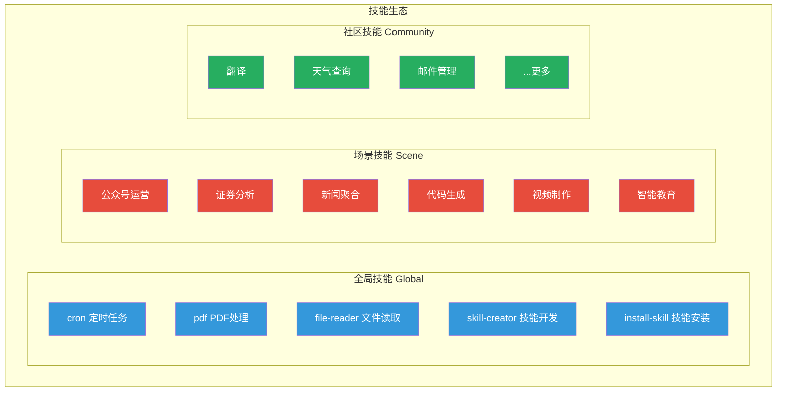
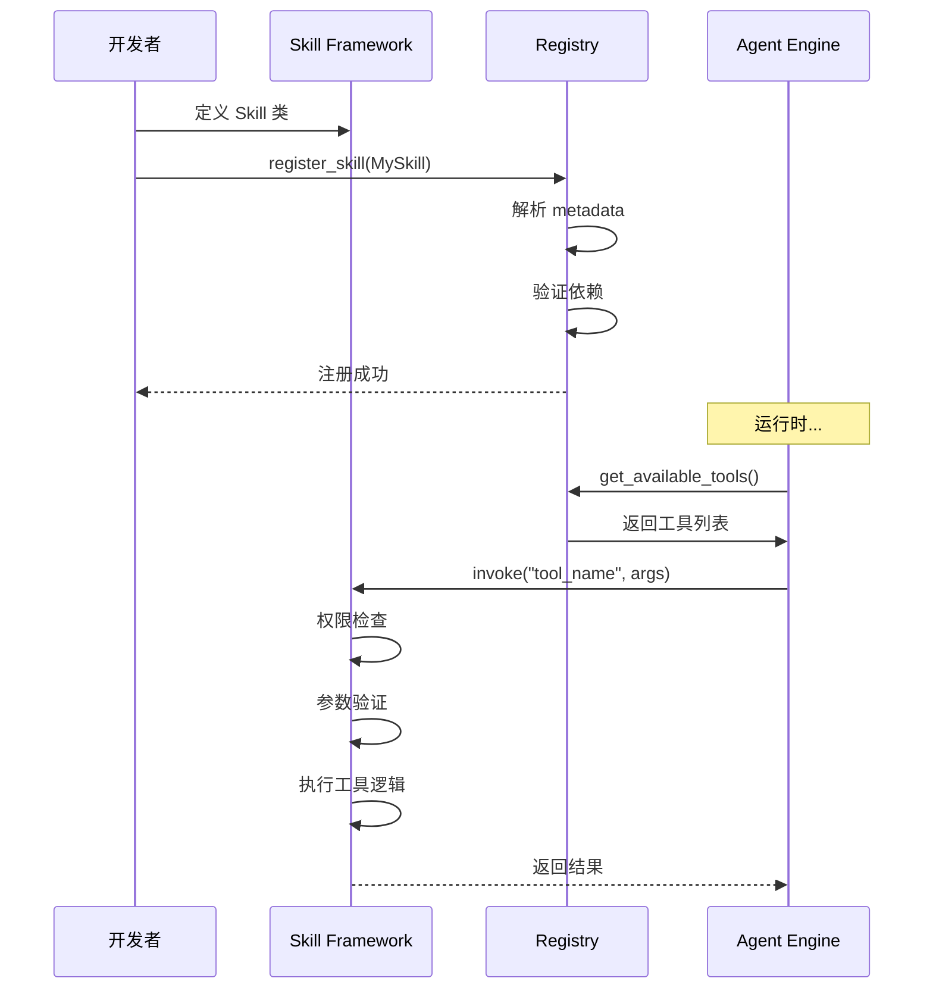
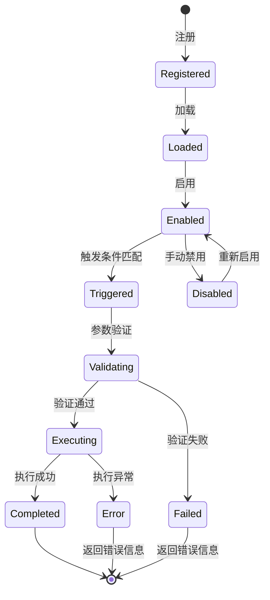

# 技能框架

技能是 LightClaw 能力的基本单元。技能框架提供了统一的定义、注册、发现和执行机制。

## 技能定义结构

每个技能是一个独立的模块，包含以下要素：

```yaml
# skill.yaml — 技能元数据定义示例
name: pdf-toolkit
version: "1.0.0"
author: OrcaKit Team
description: PDF 文件全功能处理工具
category: utility
tags:
  - pdf
  - file-processing
  - document

triggers:
  - "PDF"
  - "pdf"
  - "合并"
  - "拆分"
  - "提取"

permissions:
  required:
    - file-read
    - file-write
optional:
    - network-download

config:
  max_file_size_mb: 50
  supported_formats: [".pdf"]
  ocr_enabled: true
```

```python
# skill.py — 技能主逻辑示例
from lightclaw.agent.skills.base import BaseSkill, tool

class PDFToolkit(BaseSkill):
    """PDF 处理技能"""
    
    name = "pdf"
    description = "PDF 全功能处理工具"
    
    @tool
    async def extract_text(self, filepath: str) -> str:
        """提取 PDF 文件的文本内容
        
        Args:
            filepath: PDF 文件路径
            
        Returns:
            提取出的文本内容
        """
        import pymupdf
        doc = pymupdf.open(filepath)
        text = ""
        for page in doc:
            text += page.get_text()
        return text
    
    @tool
    async def merge_pdfs(self, filepaths: list[str], output_path: str) -> str:
        """合并多个 PDF 文件为一个
        
        Args:
            filepaths: 要合并的 PDF 文件路径列表
            output_path: 输出文件路径
            
        Returns:
            合并后的文件路径
        """
        import pymupdf
        merged = pymupdf.open()
        for fp in filepaths:
            doc = pymupdf.open(fp)
            merged.insert_pdf(doc)
        merged.save(output_path)
        return output_path
    
    @tool
    async def split_pdf(
        self, 
        filepath: str, 
        page_ranges: list[str],
        output_dir: str
    ) -> list[str]:
        """拆分 PDF 文件
        
        Args:
            filepath: PDF 文件路径
            page_ranges: 页码范围列表，如 ["1-5", "6-10"]
            output_dir: 输出目录
            
        Returns:
            拆分后的文件路径列表
        """
        # ... 实现细节
        pass
```

## 技能分类



## 技能注册机制

### 注册流程



### 自动发现

技能框架支持多种发现方式：

```python
# 1. 内置技能：在 agent/skills/ 目录下自动扫描
# src/lightclaw/agent/skills/
# ├── __init__.py
# ├── cron/
# ├── pdf/
# ├── file_reader/
# ├── skill_creator/
# └── install_skill/

# 2. 场景技能：随场景激活
# src/lightclaw/agent/scenes/wechat_ops/skills/

# 3. 社区技能：从 SkillHub 安装后注册
# ~/.lightclaw/workspace/skills/community/
```

## 技能执行生命周期



## 工具装饰器

`@tool` 装饰器将普通 Python 函数转化为 Agent 可调用的工具：

```python
@tool(
    name="calculate_bmi",
    description="计算身体质量指数 (BMI)",
    parameters={
        "weight_kg": {"type": "number", "description": "体重（公斤）"},
        "height_m": {"type": "number", "description": "身高（米）"},
    },
)
async def calculate_bmi(weight_kg: float, height_m: float) -> dict:
    bmi = weight_kg / (height_m ** 2)
    category = categorize_bmi(bmi)
    return {
        "bmi": round(bmi, 1),
        "category": category,
        "advice": get_health_advice(category),
    }
```

`@tool` 装饰器的功能：
1. **Schema 生成** — 自动生成 JSON Schema 给 LLM
2. **类型校验** — 运行时参数类型检查
3. **权限拦截** — 检查是否具备所需权限
4. **日志记录** — 自动记录调用日志和耗时
5. **错误包装** — 统一错误格式

## SkillHub 技能市场

### 发布流程

```bash
# 1. 打包技能
lightclaw skill package my-skill

# 2. 测试评估
lightclaw skill evaluate my-skill

# 3. 发布到 SkillHub
lightclaw skill publish my-skill
```

### 安装社区技能

```bash
# 从 SkillHub 安装
lightclaw skills install weather-query
lightclaw skills install email-manager

# 查看技能详情
lightclaw skills info weather-query

# 更新已安装技能
lightclaw skills update --all
```

### 安全审核

所有发布到 SkillHub 的技能都经过安全审核：

| 审核项 | 说明 |
|--------|------|
| 代码审计 | 无恶意代码、无后门 |
| 权限检查 | 只申请必要的权限 |
| 依赖审查 | 无已知漏洞依赖 |
| 功能测试 | 核心功能正常工作 |
