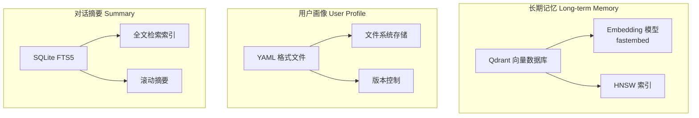

# 记忆架构

本页从技术层面深入解析 LightClaw 三层记忆系统的内部实现。

## 存储层设计



## 长期记忆实现

### 数据模型

```python
@dataclass
class MemoryEntry:
    """单条长期记忆条目"""
    id: str                          # 唯一 ID
    content: str                     # 记忆内容文本
    embedding: list[float]           # 向量 Embedding
    importance: float                # 重要性评分 0-1
    category: MemoryCategory         # 分类标签
    source_conversation_id: str      # 来源对话 ID
    created_at: datetime             # 创建时间
    updated_at: datetime             # 最后更新时间
    access_count: int                # 被检索次数
    last_accessed: datetime          # 最后访问时间


class MemoryCategory(Enum):
    USER_PREFERENCE = "user_preference"     # 用户偏好
    FACTUAL_INFO = "factual_info"            # 事实信息
    DECISION = "decision"                    # 决策记录
    RELATIONSHIP = "relationship"           # 关系信息
    GOAL = "goal"                            # 目标/计划
```

### 写入流程

```python
class MemoryWriter:
    def __init__(self, qdrant_client, embedder):
        self.client = qdrant_client
        self.embedder = embedder
        self.extractor = MemoryExtractor()
    
    async def extract_and_store(self, conversation: Conversation):
        """从对话中提取并存储记忆"""
        # 1. 调用 LLM 提取候选记忆
        candidates = await self.extractor.extract(conversation)
        
        # 2. 过滤和去重
        filtered = await self._deduplicate(candidates)
        
        # 3. 计算 Embedding
        entries = []
        for candidate in filtered:
            embedding = self.embedder.embed(candidate.content)
            entry = MemoryEntry(
                id=str(uuid.uuid4()),
                content=candidate.content,
                embedding=embedding,
                importance=candidate.importance,
                category=candidate.category,
                # ...
            )
            entries.append(entry)
        
        # 4. 批量写入 Qdrant
        await self._upsert_batch(entries)
```

### 检索流程

```python
class MemoryRetriever:
    def __init__(self, qdrant_client, embedder):
        self.client = qdrant_client
        self.embedder = embedder
    
    async def retrieve(
        self, 
        query: str, 
        top_k: int = 10,
        min_score: float = 0.5,
    ) -> list[MemoryEntry]:
        """语义检索相关记忆"""
        
        # 1. 将查询向量化
        query_embedding = self.embedder.embed(query)
        
        # 2. 在 Qdrant 中进行相似度搜索
        search_results = self.client.search(
            collection_name="long_term_memory",
            query_vector=query_embedding,
            limit=top_k,
            score_threshold=min_score,
        )
        
        # 3. 时间衰减加权
        scored_results = []
        for result in search_results:
            time_decay = self._compute_time_decay(result.payload.created_at)
            frequency_boost = math.log1p(result.payload.access_count)
            
            final_score = (
                result.score * 0.5 +          # 语义相关性
                result.payload.importance * 0.2 +  # 重要性
                time_decay * 0.15 +          # 时间新鲜度
                frequency_boost * 0.15       # 访问频率
            )
            scored_results.append((result.payload, final_score))
        
        # 4. 按综合得分排序
        scored_results.sort(key=lambda x: x[1], reverse=True)
        
        # 5. 更新访问统计
        for payload, _ in scored_results[:top_k]:
            self._update_access_stats(payload.id)
        
        return [p for p, _ in scored_results[:top_k]]
    
    def _compute_time_decay(self, created_at: datetime) -> float:
        """计算时间衰减因子"""
        age_days = (datetime.now() - created_at).days
        half_life = 90  # 90 天半衰期
        return math.exp(-age_days / half_life)
```

## 用户画像实现

### 数据结构

```yaml
# ~/.lightclaw/workspace/USER.md (YAML Front Matter + Markdown)
---
version: "1.0"
updated_at: "2026-04-08T00:00:00Z"
---

# 用户画像

## 基本信息
- **昵称**: 用户
- **语言**: 中文
- **职业**: 软件工程师

## 兴趣爱好
- 人工智能与 Agent 开发
- 投资理财
- 咖啡文化
- 开源项目贡献

## 偏好设置
### 交流风格
- 喜欢简洁专业的回答
- 不喜欢过多废话
- 技术话题可以深入

### 内容偏好
- 关注 AI/LLM 领域最新进展
- 对实用工具类产品感兴趣
- 偏好中文资料

## 目标规划
### 短期目标
- 学习 AI Agent 开发框架
- 构建个人知识管理系统

### 长期目标
- 成为 AI 应用领域专家
- 开源有影响力的项目
```

### 更新机制

```python
class UserProfileManager:
    def __init__(self, profile_path: Path):
        self.path = profile_path
        self.profile = self._load()
    
    async def update_from_conversation(self, conversation: Conversation):
        """根据对话更新画像"""
        
        changes = await self._detect_changes(conversation)
        
        for field, new_value in changes.items():
            old_value = getattr(self.profile, field, None)
            
            if old_value is None:
                # 新信息，直接添加
                setattr(self.profile, field, new_value)
            elif self._is_compatible(old_value, new_value):
                # 兼容，合并更新
                merged = self._merge(old_value, new_value)
                setattr(self.profile, field, merged)
            else:
                # 冲突，保留最新的
                setattr(self.profile, field, new_value)
                logger.warning(f"User profile conflict: {field}")
        
        self._save()
    
    def _is_compatible(self, old, new) -> bool:
        """判断新旧值是否兼容"""
        # 例如：新旧偏好不直接矛盾则兼容
        return True
```

## 对话摘要实现

### 滚动摘要算法

```python
class ConversationSummarizer:
    def __init__(self, llm, max_summary_length: int = 500):
        self.llm = llm
        self.max_length = max_summary_length
    
    async def summarize_incremental(
        self, 
        current_messages: list[Message],
        existing_summary: str | None = None,
    ) -> str:
        """增量摘要：基于旧摘要 + 新对话生成新摘要"""
        
        # 1. 确定本次需要摘要的消息范围
        messages_since_last_summary = self._get_new_messages(current_messages)
        
        # 2. 如果有旧摘要，拼接后压缩
        if existing_summary and len(existing_summary) > 100:
            prompt = f"""请将以下旧摘要和新对话合并为一份精炼的摘要。
限制 {self.max_length} 字以内。

【旧摘要】
{existing_summary}

【新增对话】
{self._format_messages(messages_since_last_summary)}

【合并后的摘要】"""
        else:
            prompt = f"""请总结以下对话的核心内容。
限制 {self.max_length} 字以内。

{self._format_messages(current_messages)}"""
        
        # 3. 调用 LLM 生成摘要
        summary = await self.llm.generate(prompt)
        
        # 4. 长度截断保护
        if len(summary) > self.max_length:
            summary = summary[:self.max_length] + "..."
        
        return summary
```

### 存储结构

```sql
-- SQLite 表结构
CREATE TABLE conversations (
    id TEXT PRIMARY KEY,
    channel TEXT NOT NULL,
    user_id TEXT NOT NULL,
    created_at TIMESTAMP DEFAULT CURRENT_TIMESTAMP,
    updated_at TIMESTAMP DEFAULT CURRENT_TIMESTAMP,
    summary TEXT,                    -- 最新摘要
    full_history_json TEXT,          -- 完整历史（可选持久化）
    message_count INTEGER DEFAULT 0
);

CREATE VIRTUAL TABLE conversation_fts USING fts5(
    content,           -- 用于搜索的内容字段
    content=conversations,
    tokenize='unicode61'
);
```

## 记忆容量管理

```python
class MemoryManager:
    def cleanup_expired_memories(self, max_age_days: int = 365):
        """清理过期且低重要性的记忆"""
        cutoff = datetime.now() - timedelta(days=max_age_days)
        
        # 删除条件：
        # 1. 超过最大年龄 AND
        # 2. 重要性低于阈值 AND
        # 3. 近期未被访问
        self.client.delete(
            collection_name="long_term_memory",
            must=[
                FieldCondition(key="created_at", match=MatchValue(range=DateTimeRange(lt=cutoff))),
                FieldCondition(key="importance", match=MatchValue(lt=0.3)),
                FieldCondition(key="last_accessed", match=MatchValue(range=DateTimeRange(lt=cutoff - timedelta(days=30)))),
            ],
        )
    
    def compact_summaries(self, target_count: int = 50):
        """压缩过多的历史摘要"""
        # 保留最近 N 条完整摘要
        # 更早的摘要合并为一条"历史概览"
        pass
```
