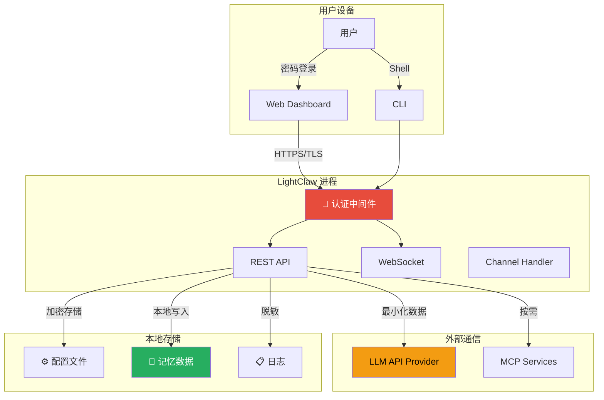
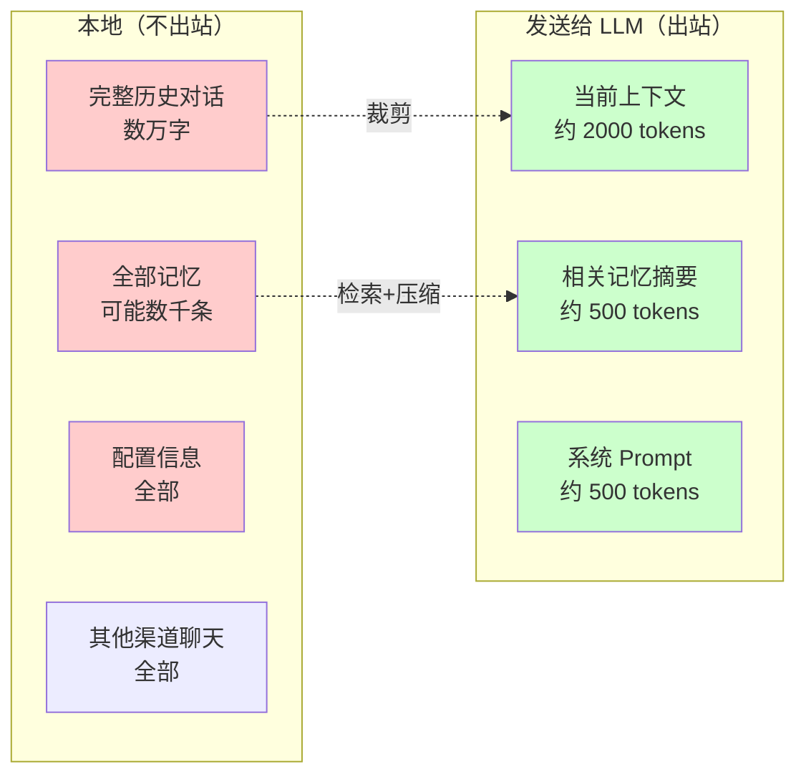

# 安全与隐私

LightClaw 采用"本地优先"的设计理念，将安全和隐私放在首位。

## 安全架构总览



## 认证与授权

### Web Dashboard 认证

```python
# 密码哈希存储（从不保存明文）
import bcrypt

def hash_password(plain_password: str) -> str:
    salt = bcrypt.gensalt(rounds=12)
    hashed = bcrypt.hashpw(plain_password.encode(), salt)
    return hashed.decode()

def verify_password(plain_password: str, stored_hash: str) -> bool:
    return bcrypt.checkpw(plain_password.encode(), stored_hash.encode())
```

### 会话管理

```python
# JWT Token 认证
import jwt
from datetime import datetime, timedelta

def create_token(user_id: str) -> str:
    payload = {
        "user_id": user_id,
        "exp": datetime.utcnow() + timedelta(hours=24),
        "iat": datetime.utcnow(),
    }
    return jwt.encode(payload, SECRET_KEY, algorithm="HS256")

def validate_token(token: str) -> dict:
    try:
        return jwt.decode(token, SECRET_KEY, algorithms=["HS256"])
    except jwt.ExpiredSignatureError:
        raise AuthError("Token expired")
    except jwt.InvalidTokenError:
        raise AuthError("Invalid token")
```

## 数据隐私保护

### 本地优先存储

| 数据类型 | 存储位置 | 是否上传第三方 |
|----------|----------|:-------------:|
| 配置文件 | `~/.lightclaw/` | ❌ |
| 对话记录 | `~/.lightclaw/workspace/memory/` | ❌ |
| 长期记忆 | Qdrant（本地） | ❌ |
| 用户画像 | `~/.lightclaw/workspace/USER.md` | ❌ |
| 上传文件 | `~/.lightclaw/workspace/uploads/` | ❌ |

### 最小化数据外传

只有当前对话上下文和裁剪后的记忆摘要会被发送到 LLM API：



### 敏感信息过滤

```python
class SensitiveDataFilter:
    """在发送给 LLM 前过滤敏感信息"""
    
    PATTERNS = [
        r'\b\d{16}\b',                    # 信用卡号
        r'\b\d{11}\b',                    # 身份证号
        r'(?:api[_-]?key|token)\s*[:=]\s*\S+',  # API Key
        r'(?:password|passwd)\s*[:=]\s*\S+',     # 密码
        r'[\w.-]+@[\w.-]+\.\w+',           # 邮箱地址
        r'1[3-9]\d{9}',                   # 手机号
    ]
    
    def filter(self, text: str) -> tuple[str, list[str]]:
        """过滤敏感信息，返回清洗后的文本和脱敏报告"""
        masked = text
        report = []
        
        for pattern in self.PATTERNS:
            matches = re.findall(pattern, text, flags=re.IGNORECASE)
            for match in matches:
                masked = masked.replace(match, "***")
                report.append(f"已隐藏: {match[:4]}...")
        
        return masked, report
```

## API Key 安全管理

### 存储方式

```json
// lightclaw.json 中的 API Key 存储（加密形式）
{
  "llm": {
    "api_key": "enc:AES256_GCM:xxxxxx..."
  }
}
```

### 环境变量优先

```bash
# 推荐：通过环境变量传入，避免写入配置文件
export OPENAI_API_KEY="sk-xxx"

# LightClaw 会自动读取环境变量
# 且环境变量的值不会出现在配置文件中
```

### 权限最小化

```bash
# 为不同的用途创建不同权限的 API Key
# OpenAI 支持 API Key 权限限制

LIGHTCLAW_OPENAI_KEY="sk-proj-limited-xxx"   # 仅用于对话，受限额度
DEVELOPER_KEY="sk-proj-full-xxx"              # 开发者使用，完全权限
```

## 渠道安全

### 飞书安全

```json
{
  "feishu": {
    "encrypt_key": "xxx",          // 消息加密密钥
    "verification_token": "xxx",   // 事件验证 Token
    "allowed_users": [],           // 白名单用户（可选）
    "mention_required": false       // 是否需要 @机器人才响应
  }
}
```

### QQ 安全

```json
{
  "qq": {
    "allowed_groups": [],           // 白名单群组
    "blocked_users": [],            // 黑名单用户
    "rate_limit": {
      "per_user": 30,               // 每用户每分钟上限
      "per_group": 60               // 每群每分钟上限
    }
  }
}
```

## MCP 服务安全

### 权限沙箱

```python
class MCPSandbox:
    """MCP 服务安全沙箱"""
    
    def __init__(self, config: MCPServerConfig):
        self.allowed_tools = set(config.get('allowTools', []))
        self.denied_tools = set(config.get('denyTools', []))
        self.confirmation_required = set(config.get('requireConfirmation', []))
    
    async def execute_tool(self, tool_name: str, args: dict) -> Any:
        # 1. 检查黑名单
        if tool_name in self.denied_tools:
            raise PermissionDeniedError(f"Tool {tool_name} is denied")
        
        # 2. 检查白名单（如果设置了白名单）
        if self.allowed_tools and tool_name not in self.allowed_tools:
            raise PermissionDeniedError(f"Tool {tool_name} not in allowlist")
        
        # 3. 检查是否需要确认
        if tool_name in self.confirmation_required:
            await self.request_user_confirmation(tool_name, args)
        
        # 4. 参数大小限制
        total_size = sum(len(str(v)) for v in args.values())
        if total_size > MAX_TOOL_ARG_SIZE:
            raise ValueError("Arguments too large")
        
        # 5. 执行工具
        return await self.call_tool(tool_name, args)
```

## 日志安全

### 脱敏规则

```python
class SecureLogger:
    """安全的日志记录器，自动脱敏"""
    
    SENSITIVE_KEYS = {
        'api_key', 'apikey', 'token', 'secret',
        'password', 'passwd', 'authorization',
        'cookie', 'credential',
    }
    
    def log_request(self, request: dict):
        safe_request = {}
        for key, value in request.items():
            if any(s in key.lower() for s in self.SENSITIVE_KEYS):
                safe_request[key] = "***REDACTED***"
            else:
                safe_request[key] = value
        logger.info(f"Request: {safe_request}")
```

## 网络安全

### TLS 强制

```python
# 生产环境强制 HTTPS
app.add_middleware(
    HTTPSRedirectMiddleware(),
)

# HSTS 头
app.add_middleware(
    StrictTransportSecurityMiddleware(
        max_age=31536000,
        include_subdomains=True,
    ),
)

# CORS 配置（仅允许可信来源）
app.add_middleware(
    CORSMiddleware(
        allow_origins=["http://localhost:3000"],  # 仅 Dashboard
        allow_credentials=True,
        allow_methods=["GET", "POST"],
        allow_headers=["Authorization", "Content-Type"],
    ),
)
```

### Rate Limiting

```python
from slowapi import Limiter, _rate_limit_exceeded_handler

limiter = Limiter(key_func=get_remote_address)

@app.post("/api/chat")
@limiter.limit("30/minute")  # 每分钟最多 30 次
async def chat(request: Request, body: ChatRequest):
    # ... 处理逻辑
    pass

@app.post("/api/auth/login")
@limiter.limit("5/minute")   # 登录接口更严格
async def login(request: Request, body: LoginRequest):
    # ... 处理逻辑
    pass
```

## 审计日志

```python
async def audit_log(action: str, details: dict, user_id: str = None):
    """记录安全相关的操作日志"""
    entry = {
        "timestamp": datetime.utcnow().isoformat(),
        "action": action,              # login, config_change, skill_install, etc.
        "details": details,           # 操作详情（已脱敏）
        "user_id": user_id,
        "ip": request.client.host if request else None,
        "user_agent": request.headers.get("user-agent") if request else None,
    }
    
    with open(AUDIT_LOG_PATH, "a") as f:
        f.write(json.dumps(entry, ensure_ascii=False) + "\n")
```

记录的操作包括：
- 用户登录/登出
- 配置修改
- 技能安装/卸载
- API Key 变更
- 权限变更
- 敏感操作确认
