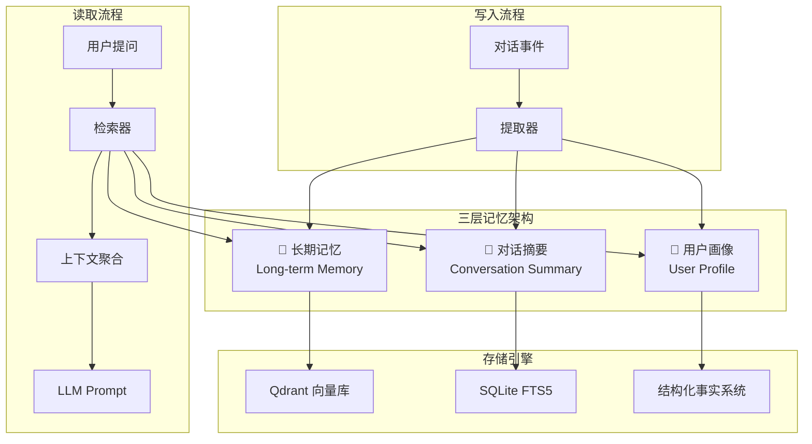
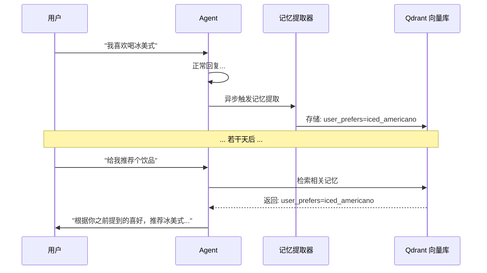
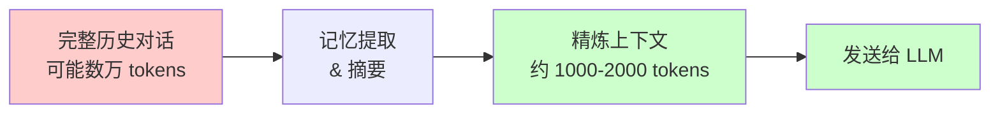

# 记忆系统

LightClaw 的记忆系统是"越用越懂你"的核心能力。它采用三层架构，让 Agent 能够跨会话记住重要信息，并根据你的习惯不断优化响应质量。

## 架构概览



## 三层记忆详解

### 🧠 长期记忆 (Long-term Memory)

长期记忆存储从对话中提取的重要事实和信息。

**存储内容：**
- 用户的偏好和喜好
- 重要的事实性信息
- 过往决策和结论
- 关系信息（人名、项目等）

**工作原理：**



**技术实现：**
- 使用 Qdrant 作为向量数据库
- 自动 Embedding 并语义检索
- 去重和冲突解决机制
- 记忆衰减和重要性评分

### 👤 用户画像 (User Profile)

用户画像是对用户的结构化描述，包含稳定的个人特征。

**包含字段：**

```yaml title="USER.md 结构示例"
name: "用户昵称"
interests:
  - "人工智能"
  - "投资理财"
  - "咖啡"

preferences:
  language: "zh-CN"
  response_style: "简洁专业"
  detail_level: "中等"

context:
  occupation: "软件工程师"
  tech_stack: ["Python", "React", "Go"]

goals:
  short_term: "学习 AI Agent 开发"
  long_term: "构建个人知识助手"
```

**更新机制：**
- 每次对话后自动更新
- 新信息与旧信息合并
- 冲突时以最新信息为准
- 可手动编辑 `~/.lightclaw/workspace/USER.md`

### 📝 对话摘要 (Conversation Summary)

对话摘要为每个会话维护压缩后的关键信息。

**摘要策略：**
- 每 N 轮对话生成一次增量摘要
- 摘要长度限制（避免无限增长）
- 按时间衰减旧摘要权重
- 支持跨会话主题关联

**存储位置：** `~/.lightclaw/workspace/memory/`

## 存储技术栈

| 组件 | 技术 | 用途 |
|------|------|------|
| 向量数据库 | Qdrant | 长期记忆的语义检索 |
| 全文搜索 | SQLite FTS5 | 对话内容的文本搜索 |
| 事实存储 | Markdown + YAML | 用户画像等结构化数据 |

## 记忆管理命令

```bash
# 查看当前记忆状态
lightclaw memory status

# 搜索记忆内容
lightclaw memory search "关键词"

# 导出全部记忆
lightclaw memory export --format json

# 清理过期记忆
lightclaw memory cleanup --older-than 30d

# 手动添加记忆
lightclaw memory add "用户偏好：喜欢简洁的回答风格"
```

## 自定义记忆行为

可以在 Agent 规则中自定义记忆的行为模式：

编辑 `~/.lightclaw/workspace/AGENTS.md`：

```markdown
# 记忆规则

## 提取规则
- 自动提取用户的显式偏好声明
- 自动记录重要的决策结果
- 不提取临时性、一次性信息

## 摘要规则
- 每隔 10 轮对话生成一次摘要
- 单条摘要不超过 500 字
- 技术细节可以省略，保留核心结论

## 隐私规则
- 不记录密码、密钥等敏感信息
- 不记录完整的身份信息
- 用户要求遗忘的信息必须删除
```

## 隐私保护

:::important 数据隐私承诺
- 所有记忆数据存储在本地 `~/.lightclaw/` 目录
- 不会上传到任何第三方服务器
- 可以随时导出或清除所有记忆数据
- 使用离线模式时完全零外部传输
:::

## 与 LLM 上下文的关系

记忆系统的另一个重要作用是**降低 Token 消耗**：



通过只发送裁剪后的上下文和记忆摘要给 LLM，而非完整对话历史，Token 消耗可以降低 **一个数量级**。
