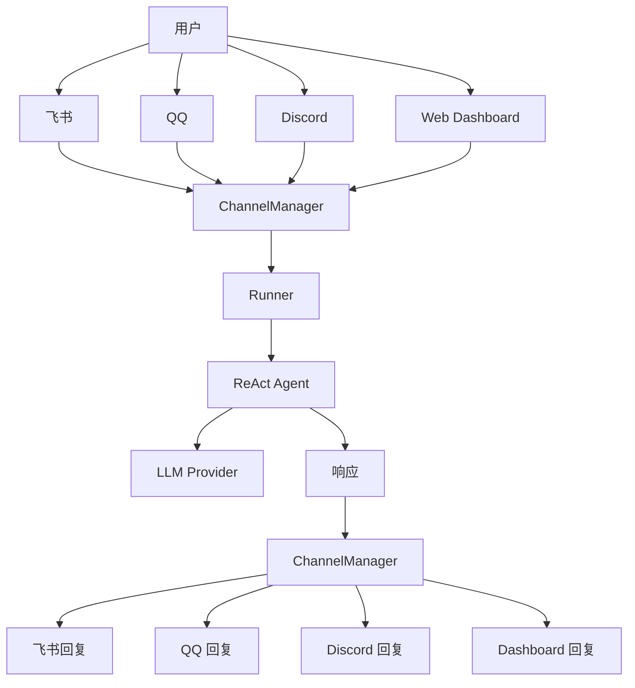

# 渠道接入配置

LightClaw 通过渠道（Channel）系统与用户交互。每个渠道是一个独立的消息通道。

## 支持的渠道

| 渠道 | 类型 | 需要凭证 | 特点 |
|------|------|---------|------|
| **飞书** | 即时通讯 | App ID + Secret | 企业场景首选 |
| **QQ** | 即时通讯 | Bot AppID + Token | 年轻群体广泛 |
| **钉钉** | 即时通讯 | App Key + Secret | 办公场景 |
| **Discord** | 社区 | Bot Token | 开发者社区 |
| **Web Dashboard** | Web | 无 | 默认启用 |

## 渠道安装

```bash
# 通用格式
lightclaw channels install <channel-name>
```

### 飞书（Feishu/Lark）

```bash
lightclaw channels install feishu
```

**前置步骤：**

1. 访问 [开放平台](https://open.feishu.cn/) 创建企业自建应用
2. 获取 App ID 和 App Secret
3. 开启机器人能力
4. 设置事件订阅回调地址

**配置文件：**

```json title="~/.lightclaw/channels/feishu.json"
{
  "app_id": "cli_xxx",
  "app_secret": "xxx",
  "verification_token": "xxx",
  "encrypt_key": "xxx"
}
```

### QQ

```bash
lightclaw channels install qq
```

**前置步骤：**

1. 访问 [QQ 开放平台](https://q.qq.com/) 创建机器人应用
2. 获取 Bot AppID 和 Token
3. 配置 WebSocket 连接

**配置文件：**

```json title="~/.lightclaw/channels/qq.json"
{
  "app_id": "xxx",
  "token": "xxx",
  "sandbox": false
}
```

### 钉钉（DingTalk）

```bash
lightclaw channels install dingtalk
```

**前置步骤：**

1. 访问 [钉钉开放平台](https://open.dingtalk.com/) 创建应用
2. 获取 App Key 和 App Secret
3. 配置机器人回调地址

**配置文件：**

```json title="~/.lightclaw/channels/dingtalk.json"
{
  "app_key": "xxx",
  "app_secret": "xxx"
}
```

### Discord

```bash
lightclaw channels install discord
```

**前置步骤：**

1. 访问 [Discord Developer Portal](https://discord.com/developers/applications) 创建 Bot
2. 获取 Bot Token
3. 开启 Message Content Intent
4. 邀请 Bot 到服务器

**配置文件：**

```json title="~/.lightclaw/channels/discord.json"
{
  "bot_token": "xxx",
  "allowed_guilds": ["guild_id_1", "guild_id_2"]
}
```

## Web Dashboard

Web Dashboard 默认启用，无需额外安装：

```bash
# 启动时指定端口
lightclaw run --port 3000
```

访问 `http://localhost:3000` 即可使用。

### Dashboard 安全配置

```json title="认证配置"
{
  "dashboard": {
    "enabled": true,
    "auth_enabled": true,
    "host": "0.0.0.0",
    "port": 80
  }
}
```

## 多渠道同时运行

LightClaw 支持同时运行多个渠道：

```bash
# 安装多个渠道后，统一启动即可
lightclaw run
```



## 渠道专属行为

可以为不同渠道设置不同的行为规则：

```json
{
  "channels": {
    "feishu": {
      "max_message_length": 2000,
      "split_long_messages": true,
      "mention_required": false
    },
    "qq": {
      "max_message_length": 4000,
      "image_compression": true,
      "at_reply": true
    }
  }
}
```

## 渠道调试

```bash
# 查看渠道状态
lightclaw channels status

# 测试渠道连接
lightclaw channels test feishu

# 查看渠道日志
lightclaw channels logs feishu --follow
```

## Webhook 回调

对于需要 webhook 回调的渠道（如飞书），确保公网可达：

```bash
# 方式一：使用 ngrok 等内网穿透工具
ngrok http 80

# 方式二：使用有公网 IP 的服务器部署
lightclaw start --host 0.0.0.0 --port 80
```
