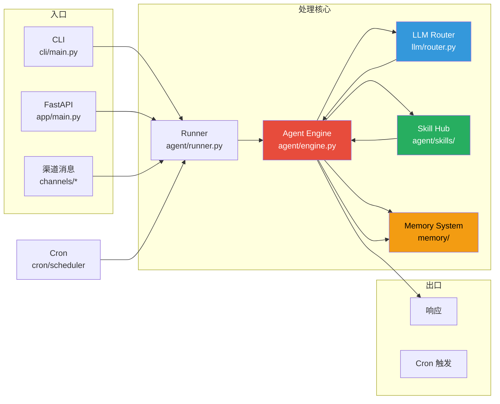

# 项目源码结构

## 目录总览

```
finnie/
├── src/
│   └── lightclaw/                    # 📦 核心包
│       ├── __init__.py               # 包初始化，版本号
│       │
│       ├── app/                      # 🌐 API 服务层
│       │   ├── __init__.py
│       │   ├── main.py               # FastAPI 应用入口
│       │   ├── api/                  # REST API 路由定义
│       │   │   ├── __init__.py
│       │   │   ├── chat.py           # 对话接口
│       │   │   ├── sessions.py       # 会话管理接口
│       │   │   ├── settings.py       # 配置接口
│       │   │   ├── skills.py         # 技能管理接口
│       │   │   ├── cron.py           # 定时任务接口
│       │   │   └── mcp.py            # MCP 服务接口
│       │   ├── channels/             # 渠道适配器
│       │   │   ├── __init__.py
│       │   │   ├── base.py           # 渠道基类
│       │   │   ├── manager.py        # 渠道管理器
│       │   │   ├── feishu.py         # 飞书适配器
│       │   │   ├── qq.py             # QQ 适配器
│       │   │   ├── dingtalk.py       # 钉钉适配器
│       │   │   └── discord.py        # Discord 适配器
│       │   ├── middleware/            # 中间件
│       │   │   ├── auth.py           # 认证中间件
│       │   │   ├── rate_limit.py     # 限流中间件
│       │   │   └── error_handler.py  # 错误处理中间件
│       │   └── schemas/              # Pydantic 数据模型
│       │
│       ├── agent/                    # 🤖 Agent 引擎
│       │   ├── __init__.py
│       │   ├── engine.py             # ReAct Agent 主引擎
│       │   ├── runner.py             # 任务运行器
│       │   ├── prompts/              # Prompt 模板
│       │   │   ├── system.py         # 系统 Prompt 构建
│       │   │   ├── scenes/           # 场景 Prompt
│       │   │   │   ├── wechat_ops.md
│       │   │   │   ├── stock_assistant.md
│       │   │   │   ├── news_tracker.md
│       │   │   │   ├── low_code_dev.md
│       │   │   │   ├── video_prod.md
│       │   │   │   └── smart_edu.md
│       │   │   └── tools.py          # 工具描述模板
│       │   ├── skills/               # 内置技能实现
│       │   │   ├── __init__.py
│       │   │   ├── base.py           # 技能基类
│       │   │   ├── registry.py       # 技能注册表
│       │   │   ├── cron/             # 定时任务技能
│       │   │   ├── pdf/              # PDF 处理技能
│       │   │   ├── file_reader/      # 文件读取技能
│       │   │   ├── skill_creator/    # 技能创建器
│       │   │   └── install_skill/    # 技能安装器
│       │   ├── scenes/               # 场景配置
│       │   │   ├── __init__.py
│       │   │   ├── wechat_ops/       # 公众号运营场景
│       │   │   ├── stock_assistant/  # 证券分析场景
│       │   │   ├── news_tracker/     # 新闻追踪场景
│       │   │   ├── low_code_dev/     # 轻代码开发场景
│       │   │   ├── video_prod/       # 视频制作场景
│       │   │   └── smart_edu/        # 智能教育场景
│       │   └── tools/                # 底层内置工具
│       │       ├── shell.py          # Shell 命令执行
│       │       ├── file_tools.py     # 文件操作工具
│       │       ├── browser.py        # Playwright 浏览器
│       │       ├── screenshot.py     # 截图工具
│       │       └── time_tool.py      # 时间工具
│       │
│       ├── memory/                   # 🧠 记忆系统
│       │   ├── __init__.py
│       │   ├── base.py               # 记忆基类
│       │   ├── long_term.py          # 长期记忆 (Qdrant)
│       │   ├── user_profile.py       # 用户画像管理
│       │   ├── summary.py            # 对话摘要
│       │   ├── extractor.py          # 记忆提取器
│       │   └── retriever.py          # 记忆检索器
│       │
│       ├── llm/                      # 🔄 LLM 管理
│       │   ├── __init__.py
│       │   ├── base.py               # LLM 提供商基类
│       │   ├── router.py             # 多模型路由器
│       │   ├── context_manager.py    # 上下文窗口管理
│       │   └── providers/            # 各供应商实现
│       │       ├── openai.py
│       │       ├── dashscope.py
│       │       ├── ollama.py
│       │       ├── llama_cpp.py
│       │       └── mlx_provider.py
│       │
│       ├── mcp/                      # 🔗 MCP 集成
│       │   ├── __init__.py
│       │   ├── client.py             # MCP 客户端
│       │   ├── server_registry.py    # 服务注册表
│       │   └── tool_adapter.py       # MCP 工具适配器
│       │
│       ├── cron/                     # ⏰ 定时任务系统
│       │   ├── __init__.py
│       │   ├── scheduler.py          # APScheduler 封装
│       │   ├── models.py             # 任务数据模型
│       │   └── executor.py           # 任务执行器
│       │
│       └── cli/                      # 💻 CLI 命令行
│           ├── __init__.py
│           ├── main.py               # CLI 入口
│           ├── commands/             # 子命令实现
│           │   ├── init.py
│           │   ├── config_cmd.py
│           │   ├── run_cmd.py
│           │   ├── channel_cmds.py
│           │   ├── skill_cmds.py
│           │   ├── model_cmds.py
│           │   ├── cron_cmds.py
│           │   └── memory_cmds.py
│           └── utils/                # CLI 工具函数
│
├── dashboard/                        # 🖥️ Web 前端
│   ├── src/
│   │   ├── components/               # 通用组件
│   │   │   ├── ChatWindow.jsx        # 聊天窗口
│   │   │   ├── SessionList.jsx       # 会话列表
│   │   │   ├── SettingsPanel.jsx     # 设置面板
│   │   │   ├── SkillManager.jsx      # 技能管理
│   │   │   ├── CronEditor.jsx        # Cron 编辑器
│   │   │   └── MCPManager.jsx        # MCP 管理面板
│   │   ├── pages/                    # 页面组件
│   │   │   ├── ChatPage.jsx
│   │   │   ├── SettingsPage.jsx
│   │   │   └── LoginPage.jsx
│   │   ├── hooks/                    # 自定义 Hooks
│   │   ├── api/                      # API 调用层
│   │   ├── store/                    # 状态管理
│   │   └── styles/                   # 样式文件
│   └── package.json
│
├── tests/                            # 🧪 测试套件
│   ├── test_agent/                   # Agent 相关测试
│   ├── test_memory/                  # 记忆系统测试
│   ├── test_channels/                # 渠道适配器测试
│   ├── test_skills/                  # 技能测试
│   ├── test_llm/                     # LLM 管理测试
│   └── conftest.py                   # pytest 全局 fixtures
│
├── docs/                             # 📚 项目文档
│   ├── superpowers/                  # 设计文档
│   └── *.md
│
├── scripts/                          # 🔧 辅助脚本
│   ├── install.sh                    # 一键安装脚本
│   ├── build.sh                      # 构建脚本
│   └── release.sh                    # 发布脚本
│
├── star_office/                      # 🏢 Star Office 可视化
│   ├── frontend/                     # 前端资源
│   └── assets/                       # 静态资源
│
├── pyproject.toml                    # Python 包配置
├── Dockerfile                        # Docker 构建文件
├── docker-compose.yml                # 编排配置
├── Makefile                          # Make 命令快捷方式
├── AGENTS.md                         # Agent 规则参考
├── CLAUDE.md                         # 编码规范
├── LICENSE                           # MIT 许可证
├── README_zh.md                      # 中文 README
└── README.md                         # 英文 README
```

## 核心数据流



## 关键模块关系

| 模块 | 依赖 | 被依赖 |
|------|------|--------|
| `app/api/*` | agent, memory, llm, channels | 外部客户端 |
| `agent/engine` | llm, memory, skills, mcp | app, runner, cron |
| `agent/skills/*` | base skill class, external libs | agent/engine |
| `memory/*` | qdrant-client, sqlite | agent/engine |
| `llm/*` | langchain, openai/dashscope etc. | agent/engine |
| `channels/*` | app/api schemas | external platforms |
| `cli/*` | all internal modules | terminal user |
| `cron/*` | agent/runner, scheduler | time events |
