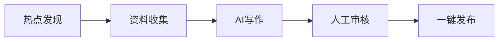
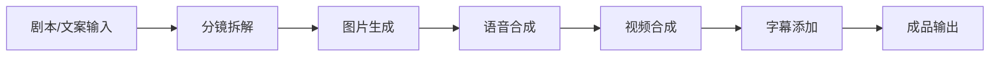

# 内置场景

LightClaw 内置了 6 个深度打磨的**场景（Scene）**— 每个场景是一套完整的 Agent 配置包，包含专属人格、专属技能和场景优化过的行为规则。

## 场景总览

| 场景 | 图标 | 说明 | 示例提示词 |
|------|------|------|-----------|
| 微信公众号运营 | ✍️ | 全链路内容运营 | "帮我写一篇关于 AI 热点的公众号文章" |
| 证券市场助手 | 📈 | 行情分析与技术分析 | "帮我看看今天 A 股有什么值得关注的" |
| 热点新闻趋势 | 📰 | 70+ 平台实时热点聚合 | "帮我总结今天的科技新闻" |
| 轻代码开发 | 💻 | 全栈开发辅助 | "帮我做一个个人博客网站" |
| 视频剪辑助手 | 🎬 | 文字到视频的全自动生成 | "帮我把这个故事拍成一个短视频" |
| 智能教育助手 | 🎓 | 个性化 AI 家教 | "帮我制定 30 天学完线性代数的计划" |

---

## ✍️ 微信公众号运营

从选题到发布的全链路内容运营工具。

### 功能特性

- 🔥 **热点发现** — 自动追踪微博、知乎、百度等平台的热门话题
- 📝 **AI 写作** — 基于热点素材生成高质量公众号文章
- 📊 **数据分析** — 分析竞品账号的爆款文章特征
- 🚀 **一键发布** — 通过微信 API 直接发布到公众号

### 典型工作流



### 示例对话

> **用户**: "最近 AI Agent 很火，帮我写一篇关于这个话题的公众号文章"

LightClaw 会：
1. 自动搜索最新的 AI Agent 相关资讯
2. 整理关键信息和观点
3. 生成一篇结构完整、风格匹配的文章
4. 支持直接发布或导出草稿

---

## 📈 证券市场助手

市场观察者「老钱」— 查行情、看基本面、做技术分析。

### 功能特性

- 📊 **实时行情** — A股、港股、美股实时行情查询
- 📈 **技术分析** — MA/MACD/RSI/BOLL/KDJ 等经典指标
- 📑 **基本面分析** — 财报解读、行业对比、估值分析
- 🔗 **akshare 集成** — 1090+ 数据接口覆盖

### 支持的分析指标

| 类别 | 包含指标 |
|------|----------|
| **均线类** | MA, EMA, SMA |
| **趋势类** | MACD, BOLL, SAR |
| **动量类** | RSI, KDJ, CCI |
| **成交量类** | OBV, VOL |

### 示例对话

> **用户**: "帮我分析一下贵州茅台的技术面"

> **用户**: "今天半导体板块有什么异动？"

---

## 📰 热点新闻趋势

从 70+ 平台实时抓取热点，生成个性化新闻简报。

### 数据来源

- 国内：微博热搜、知乎热榜、百度指数、今日头条、抖音热榜
- 国际：Hacker News、Reddit、GitHub Trending、Product Hunt
- 垂直：36氪、虎嗅、少数派、V2EX

### 功能特性

- ⏰ **定时推送** — 设定每日/每周的新闻简报时间
- 🏷️ **智能分类** — 自动按领域分类（科技、财经、文化等）
- 📋 **个性化筛选** — 根据你的兴趣偏好过滤内容
- 📤 **多渠道分发** — 同时推送到飞书/QQ/微信等

### 示例对话

> **用户**: "帮我做一个每日早报，早上 7 点发给我"

> **用户": "今天有什么值得关注的大事件？"

---

## 💻 轻代码开发

全栈开发助手：需求分析 → 代码生成 → 本地预览 → 迭代优化。

### 功能特性

- 💬 **自然语言编程** — 用中文描述需求，自动生成代码
- 🖼️ **可视化预览** — 实时预览生成的网页效果
- 🔄 **迭代优化** — 根据反馈持续改进代码
- 📦 **一键部署** — 支持部署到 Vercel、Netlify 等

### 支持的技术栈

| 前端 | 后端 | 数据库 |
|------|------|--------|
| React / Vue / HTML | Python / Node.js | SQLite / PostgreSQL |
| Tailwind CSS | FastAPI / Flask | — |
| TypeScript | — | — |

### 示例对话

> **用户**: "帮我做一个暗色主题的个人博客"

> **用户**: "给这个网页加一个搜索功能"

---

## 🎬 视频剪辑助手

文字到成片的全自动视频生成流水线。

### 工作流



### 功能特性

- 📝 **剧本解析** — 将文字内容拆解为分镜脚本
- 🎨 **图片生成** — 为每个分镜生成匹配的图像
- 🗣️ **语音合成** — 多种 TTS 引擎可选（Edge-TTS / Kokoro / XTTS）
- ✂️ **视频合成** — 图片转场动画 + 背景音乐
- 📝 **字幕生成** — 自动生成同步字幕

### TTS 引擎选项

| 引擎 | 特点 |
|------|------|
| Edge-TTS | 免费，微软语音，质量高 |
| Kokoro | 高质量日语/英语 |
| XTTS | Coqui 出品，支持声音克隆 |

### 示例对话

> **用户**: "把《小王子》的故事做成一个 3 分钟的短视频"

---

## 🎓 智能教育助手

个性化 AI 家教，打造专属学习方案。

### 功能特性

- 📅 **学习计划** — 根据目标和时间制定科学的学习路线图
- 👨‍🏫 **知识讲解** — 深入浅出地讲解复杂概念
- 📝 **智能出题** — 根据掌握程度动态调整题目难度
- ❌ **错题分析** — 追踪错题，定位知识盲点
- 🔄 **间隔复习** — 基于 Spaced Repetition 的复习提醒

### 适用学科

数学、物理、化学、生物、历史、地理、编程、外语等。

### 示例对话

> **用户**: "我想要 30 天学会线性代数，帮我做个计划"

> **用户**: "讲解一下梯度下降的原理"

> **用户**: "出几道关于微积分的练习题"

## 切换场景

```bash
# 在 CLI 中切换场景
lightclaw scene list        # 查看所有场景
lightclaw scene use stock   # 切换到证券场景
```

或在 Web Dashboard 的设置中切换。
