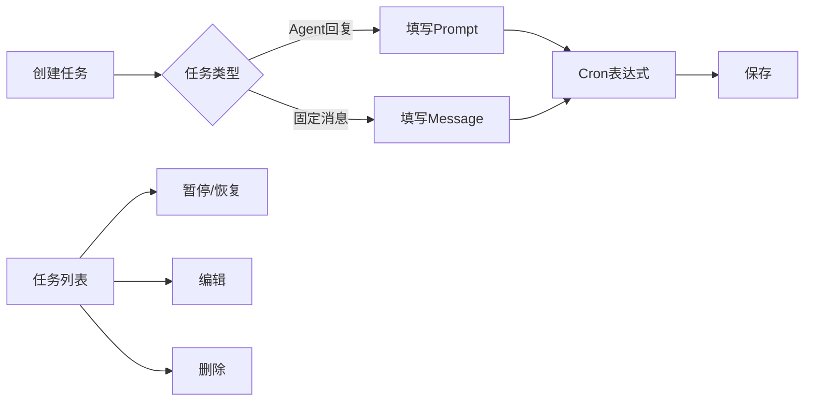

# Web Dashboard

LightClaw 提供了一个功能丰富的 Web Dashboard，默认在 `http://localhost:80` 访问。

## 功能概览

| 功能 | 说明 |
|------|------|
| 💬 **Chat** | 与 LightClaw 进行实时对话 |
| 📋 **Sessions** | 浏览和管理历史会话 |
| ⚙️ **设置** | 配置 LLM 供应商、模型、渠道 |
| 🧩 **技能** | 启用/禁用技能，管理技能参数 |
| ⏰ **定时任务** | 可视化 Cron 任务管理 |
| 🔗 **MCP** | 管理 MCP 工具服务 |
| 📊 **环境变量** | 管理持久化环境变量 |

## Chat 对话

主界面是聊天窗口，支持以下交互方式：

- **纯文本对话** — 直接输入问题或指令
- **文件上传** — 上传文件让 LightClaw 处理
- **Markdown 渲染** — 支持表格、代码块等富文本输出
- **流式输出** — 实时显示 AI 的回复过程
- **上下文延续** — 同一会话内保持上下文连贯

### 快捷操作

| 操作 | 方式 |
|------|------|
| 发送消息 | `Enter` 或点击发送按钮 |
| 换行 | `Shift + Enter` |
| 清空对话 | 点击清空按钮 |
| 导出对话 | 点击导出按钮 |

## Sessions 会话管理

- 📂 查看所有历史会话列表
- 🔍 搜索历史对话内容
- 📌 收藏重要的对话
- 🗑️ 删除不需要的会话
- 🔄 从历史会话继续对话

## Settings 设置

### LLM 供应商设置

- 添加/删除 LLM 供应商
- 配置 API Key 和 Base URL
- 选择默认模型
- 设置温度、最大 token 等参数

### 渠道设置

- 配置各渠道的凭证信息
- 启用/禁用渠道
- 设置渠道专属行为规则

### 场景切换

- 选择当前使用的场景
- 自定义场景的人格设定

## Skills 技能管理

- 📦 查看已安装的所有技能
- ✅ / ❌ 单独启用/禁用技能
- ⚙️ 配置技能参数
- 📥 从 SkillHub 安装新技能
- 🔄 更新旧版技能

## Cron 定时任务

可视化的定时任务管理界面：



- 📅 日历视图查看任务分布
- ⏱️ 可视化编辑 Cron 表达式
- 📊 任务执行历史和日志
- ▶️ 手动触发生效测试

## MCP 服务管理

- ➕ 添加 MCP 服务（stdio / HTTP / SSE）
- 🔗 查看已连接的工具列表
- 🛠️ 测试 MCP 工具是否正常工作
- 📋 查看工具的 schema 定义

## Env 环境变量

管理 Agent 运行时的环境变量：

```bash
# 例如设置 API Key
OPENAI_API_KEY=sk-xxx
DASHSCOPE_API_KEY=sk-xxx
```

- 🔒 敏感值隐藏显示
- ✏️ 在线编辑变量值
- 📥 批量导入/导出
- 🔄 重载生效

## 安全认证

Dashboard 支持密码认证保护：

1. 首次访问时会引导设置管理员密码
2. 后续登录需输入密码
3. 密码以哈希形式存储，不保存明文
4. 支持修改密码和找回密码

```bash
# 也可以通过 CLI 管理认证
lightclaw auth set-password
lightclaw auth reset-password
```
