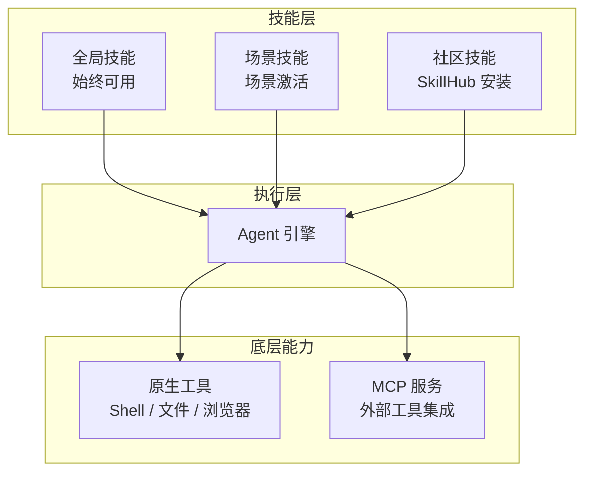

# 技能系统

LightClaw 的所有能力由**技能（Skill）**系统驱动。技能是可插拔的功能模块，可以独立启用/禁用、安装和卸载。

## 技能架构概览



## 全局技能（始终可用）

以下技能在任何场景下都可以使用：

| 技能 | 功能描述 |
|------|----------|
| `cron` | 定时任务管理 — 创建、列表、暂停、恢复、删除。支持固定消息和 Agent 智能回复两种模式 |
| `pdf` | PDF 全功能处理 — 提取文本/表格、合并拆分、旋转裁剪、添加水印、加密解密、OCR、表单填写 |
| `file-reader` | 读取本地文本文件（.txt / .md / .json / .yaml / .csv / .log / 代码等），大文件自动摘要 |
| `skill-creator` | 技能开发全流程 — 创建、修改、评估测试、基准对比、优化触发描述 |
| `install-skill` | 从 SkillHub 技能市场搜索、安装和管理社区技能 |

### cron — 定时任务

```bash
# 创建定时任务（Agent 回复模式）
lightclaw cron create \
  --name "每日晨报" \
  --cron "0 8 * * *" \
  --prompt "帮我总结今天的科技新闻和财经要闻"

# 创建定时任务（固定消息模式）
lightclaw cron create \
  --name "打卡提醒" \
  --cron "0 9 * * 1-5" \
  --message "别忘了打卡！💪"

# 列出所有任务
lightclaw cron list

# 暂停任务
lightclaw cron pause <task-id>

# 恢复任务
lightclaw cron resume <task-id>

# 删除任务
lightclaw cron delete <task-id>
```

Cron 表达式格式：

```
┌───────────── 分钟 (0-59)
│ ┌───────────── 小时 (0-23)
│ │ ┌───────────── 日 (1-31)
│ │ │ ┌───────────── 月 (1-12)
│ │ │ │ ┌───────────── 星期 (0-6, 0=周日)
│ │ │ │ │
* * * * *
```

### pdf — PDF 处理

```python
# 示例：提取 PDF 文本
# 用户说："帮我提取这个 PDF 的文字内容"

# 示例：合并 PDF
# 用户说："把这三个 PDF 合并成一个"

# 示例：添加水印
# 用户说："给这份报告加上'机密'水印"
```

### file-reader — 文件读取

支持的文件类型：
- 文本文件: `.txt`, `.md`, `.rst`, `.log`
- 数据文件: `.json`, `.yaml`, `.yml`, `.toml`, `.csv`, `.xml`
- 代码文件: `.py`, `.js`, `.ts`, `.go`, `.java`, `.rs`, `.c`, `.cpp`, `.h`
- 配置文件: `.ini`, `.cfg`, `.conf`, `.env`

超过 10000 字符的文件会自动进行摘要处理。

### skill-creator — 技能开发

```bash
# 创建新技能
lightclaw skill create my-skill

# 编辑技能定义
lightclaw skill edit my-skill

# 测试技能
lightclaw skill test my-skill

# 评估技能效果
lightclaw skill evaluate my-skill
```

### install-skill — 技能市场

```bash
# 搜索技能
lightclaw skills search "翻译"

# 安装技能
lightclaw skills install <skill-name>

# 更新已安装的技能
lightclaw skills update

# 列出已安装的技能
lightclaw skills list
```

## 底层原生工具（始终开启）

这些是 Agent 最基础的操作能力：

| 工具 | 功能描述 |
|------|----------|
| `execute_shell_command` | 执行 Shell 命令 |
| `read_file` | 读取文件内容 |
| `write_file` | 创建新文件或覆写已有文件 |
| `edit_file` | 编辑文件的指定部分 |
| `browser_use` | Playwright 浏览器自动化（网页访问、表单填写、数据提取、截图） |
| `desktop_screenshot` | 桌面 / 窗口截图 |
| `send_file_to_user` | 向用户发送文件 |
| `get_current_time` | 获取当前系统时间 |

## 场景专属技能

每个内置场景都配备了一组专属技能：

- **微信公众号运营** — 公众号 API 调用、排版美化、封面生成
- **证券市场助手** — 行情查询、技术指标计算、财报解析
- **热点新闻趋势** — 多平台爬虫、热度排名、关键词提取
- **轻代码开发** — 代码生成、项目构建、部署发布
- **视频剪辑助手** — 分镜拆解、图片生成、TTS、视频合成
- **智能教育助手** — 学习路径规划、知识点图谱、自适应出题

## MCP 集成

LightClaw 完全支持 MCP (Model Context Protocol)，可以将任何 MCP 工具作为技能使用：

```bash
# 查看 MCP 配置
lightclaw mcp list

# 添加 MCP 服务
lightclaw mcp add my-tool --command node --args server.js --transport stdio

# 添加 HTTP MCP 服务
lightclaw mcp add remote-tool --url https://api.example.com/mcp --transport sse
```

详细配置参见 [MCP 集成指南](/docs/配置指南/高级配置/MCP集成)。

## 开发自定义技能

详见 [自定义技能开发](/docs/开发指南/开发与贡献/自定义技能开发)。
